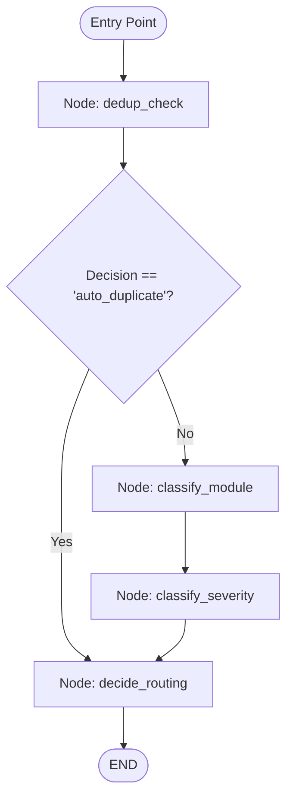
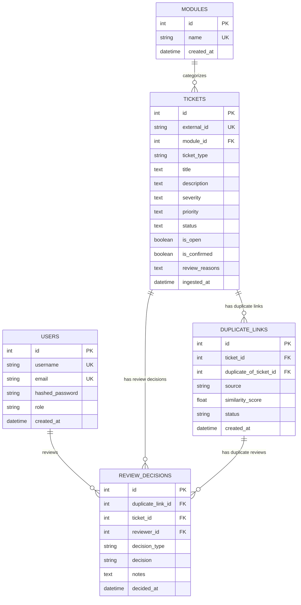

# Support Ticket Deduplication & Routing Platform
## Comprehensive Evaluation Interview Questions & Answers

This guide is designed for technical evaluation interviews, system defense presentations, and architectural deep-dives on the **Support Ticket Deduplication and Routing Platform**.

---

## Table of Contents
1. [Project Overview & System Architecture](#1-project-overview--system-architecture)
2. [AI & Machine Learning (Embeddings, Vector Search & Classification)](#2-ai--machine-learning-embeddings-vector-search--classification)
3. [Decision Thresholds, Routing Logic & Human-in-the-Loop](#3-decision-thresholds-routing-logic--human-in-the-loop)
4. [Agentic AI Workflow (LangGraph Implementation)](#4-agentic-ai-workflow-langgraph-implementation)
5. [Retrieval-Augmented Generation (RAG) & Q&A Engine](#5-retrieval-augmented-generation-rag--qa-engine)
6. [Backend Engineering, Database Design & Microservices](#6-backend-engineering-database-design--microservices)
7. [Security, Authentication & Role-Based Access Control (RBAC)](#7-security-authentication--role-based-access-control-rbac)
8. [Testing Strategy, Validation & Quality Assurance](#8-testing-strategy-validation--quality-assurance)
9. [DevOps, Docker & Production Scalability](#9-devops-docker--production-scalability)
10. [Challenges, Debugging Stories & Architectural Trade-offs](#10-challenges-debugging-stories--architectural-trade-offs)

---

## 1. Project Overview & System Architecture

### Q1.1: What is the high-level objective of this project, and what business problem does it solve?
**Answer:**
In large-scale enterprise software ecosystems and open-source foundations (e.g., Eclipse Bugzilla with 300,000+ historical tickets), engineering teams are overwhelmed by high volumes of incoming tickets. A significant percentage of these tickets are exact or semantic duplicates of known bugs, incorrectly categorized into modules, or assigned improper severities.

This platform solves four core operational bottlenecks:
1. **Redundant Engineering Triage:** Automatically detects semantic duplicates at submission time using vector similarity search, closing obvious duplicates immediately.
2. **Misrouting & Delay:** Automatically predicts the target software module (e.g., JDT, CDT, PDE, Platform) and severity using trained ML classifiers.
3. **Uncertainty Management:** Routes borderline duplicates and low-confidence classifications into specialized **Human Review Queues**, ensuring high precision without sacrificing automation.
4. **Knowledge Retrieval & Reporting:** Provides an Agentic Assistant workflow (LangGraph), an LLM-powered RAG Q&A system for knowledge discovery, and an isolated microservice for automated ticket summaries and weekly operational reporting.

---

### Q1.2: Can you describe the end-to-end system architecture and why microservices were chosen?
**Answer:**
The system is built as a multi-tier microservices architecture containerized with Docker Compose:

```
                          User / Client / Swagger UI
                                      |
                                      v
                     +---------------------------------+
                     |         Ticket Service          |
                     |         (FastAPI :8000)         |
                     +---------------------------------+
                        /             |             \
                       /              |              \
                      v               v               v
               +------------+  +-------------+  +-------------+
               | PostgreSQL |  |  ChromaDB   |  |  ML Models  |
               | (Relational|  |   (Vector   |  | (TF-IDF +   |
               |  Storage)  |  | Embeddings) |  | LogReg /    |
               +------------+  +-------------+  | LangGraph)  |
                      ^                         +-------------+
                      |                                |
                      +---------------+----------------+
                                      |
                         HTTP Internal Service Call
                       (Header: X-Internal-Key auth)
                                      |
                                      v
                     +---------------------------------+
                     |        Document Service         |
                     |         (FastAPI :8001)         |
                     +---------------------------------+
                                      |
                         +------------+------------+
                         |                         |
                         v                         v
                 Ticket Summaries           Weekly Reports
                 (Plain Text Files)       (Aggregated Stats)
```

**Why Microservices?**
- **Separation of Concerns:** `ticket-service` is compute- and I/O-intensive (vector searches, ML inferences, token auth, DB transactions). `doc-service` is an I/O-bound reporting and document generation service.
- **Fault Isolation & Resilience:** If document generation or file system storage experiences issues, core ticket creation, duplicate detection, and triage remain 100% operational.
- **Independent Scaling:** In high-volume operations, report generation (which can run heavy aggregation queries) can be scaled or scheduled independently without degrading real-time ticket ingestion latency.

---

### Q1.3: What technologies make up the tech stack, and why was each chosen?
**Answer:**
- **FastAPI & Pydantic:** High performance (ASGI), native async support, automated OpenAPI/Swagger documentation, and strict type-validation schemas.
- **PostgreSQL 17 & SQLAlchemy 2.0:** Robust relational database for transactional integrity (ACID), foreign-key relational models (`tickets`, `modules`, `duplicate_links`, `users`, `review_decisions`), indexing, and Alembic database migrations.
- **ChromaDB & Sentence-Transformers (`all-MiniLM-L6-v2`):** Persistent, lightweight vector database paired with an efficient 384-dimensional sentence transformer model offering high semantic search accuracy with minimal latency.
- **Scikit-Learn (`TfidfVectorizer` + `LogisticRegression`):** Fast, interpretable, deterministic text classification for module and severity prediction with calibrated probabilities.
- **LangGraph & ChatGroq (`openai/gpt-oss-120b` / `llama-3.3-70b`):** StateGraph-driven agentic orchestration with conditional branching and ultra-fast RAG Q&A inference.
- **SlowAPI:** In-memory token-bucket rate limiting to protect endpoints against abuse and DDoS.
- **Docker & Docker Compose:** Predictable, reproducible container environments across staging and production.

---

## 2. AI & Machine Learning (Embeddings, Vector Search & Classification)

### Q2.1: How does the semantic duplicate detection pipeline work under the hood?
**Answer:**
1. **Text Normalization (`src/ml/ticket_text.py`):** The incoming ticket's title and description are structured into a canonical text format:
   ```python
   def build_ticket_text(title, description):
       if title and description:
           return f"Summary: {title}\nDescription: {description}"
       elif title:
           return f"Summary: {title}"
       elif description:
           return f"Description: {description}"
       return ""
   ```
2. **Dense Vector Embedding:** The normalized string is transformed into a 384-dimensional dense vector using `SentenceTransformer("all-MiniLM-L6-v2")` with L2-normalized embeddings (`normalize_embeddings=True`).
3. **ChromaDB Top-K Search:** The vector is queried against the persistent ChromaDB collection (`eclipse_tickets`) using cosine similarity.
4. **Distance-to-Similarity Conversion:** ChromaDB measures squared Euclidean distance ($d_{L2}^2$) on unit-normalized vectors. Cosine similarity ($S_C$) is calculated via:
   $$S_C = 1.0 - \frac{d_{L2}^2}{2.0}$$
5. **PostgreSQL Hydration:** Top match candidates are enriched with live metadata (module name, status, severity, product, component) from PostgreSQL using SQLAlchemy joins.

---

### Q2.2: What was the critical "Summary vs Title" bug you resolved in the embedding pipeline?
**Answer:**
- **The Issue:** In early iterations, `embedding.py` (which built the vector index over historical tickets) prefixed the text with `"Summary: {title}\nDescription: {description}"`, whereas `similarity_search.py` (which queried new tickets) formatted the query as `"Title: {title}\nDescription: {description}"`.
- **The Impact:** Because transformer models treat label prefix words as real semantic tokens, the embedding space shifted slightly. As a result, exact duplicate tickets failed to achieve near $1.0$ similarity (scoring only $\approx 0.78$), causing exact duplicates to be misrouted to human review or marked as new tickets.
- **The Fix:** Created a **Single Source of Truth** module (`src/ml/ticket_text.py`) containing `build_ticket_text()`. Both the indexing script and the real-time inference pipeline now import this identical function, guaranteed by automated regression test `test_identical_text_scores_near_perfect_similarity()`.

---

### Q2.3: How are the Module and Severity ML classifiers designed and trained?
**Answer:**
- **Architecture:** Both classifiers use a pipeline composed of `TfidfVectorizer(max_features=20000, ngram_range=(1, 2))` followed by `LogisticRegression(max_iter=1000, class_weight="balanced")`.
- **Module Classifier:** Classifies tickets into Eclipse modules (e.g., `Platform`, `JDT`, `PDE`, `CDT`, `BIRT`, `Equinox`, `Mylyn`, `Papyrus`). `predict_proba` extracts the softmax confidence score.
- **Severity Classifier & Preventing Data Leakage:**
  - In the raw Eclipse dataset, `enhancement` was listed under severity for feature requests.
  - If enhancements were included in the severity classifier, the model would achieve artificially inflated accuracy by classifying obvious feature requests rather than learning genuine bug severity distinctions (Blocker, Critical, Major, Normal, Minor, Trivial).
  - **Solution:** Filtered the training dataset to include **only** rows where `ticket_type == 'bug_report'`, completely separating feature request handling from bug severity prediction.
- **Handling Class Imbalance:** `class_weight="balanced"` adjusts weights inversely proportional to class frequencies, preventing dominant classes (like `Platform` or `Normal`) from overwhelming minority classes (like `BIRT` or `Blocker`).

---

## 3. Decision Thresholds, Routing Logic & Human-in-the-Loop

### Q3.1: What are the exact thresholds used in the platform, and how were they empirically derived?
**Answer:**
The system enforces the following thresholds (`src/services/ticket_service.py`):

| Threshold Name | Value | Meaning / Action |
| :--- | :--- | :--- |
| `AUTO_DUPLICATE_THRESHOLD` | **$\ge 0.85$** | High confidence duplicate. Auto-close ticket (`closed_as_duplicate`), mark `is_open=False`, create `confirmed` DuplicateLink. |
| `HUMAN_REVIEW_THRESHOLD` | **$\ge 0.65$** | Potential duplicate. Route to Duplicate Review Queue (`pending_review`), create `pending_review` DuplicateLink. |
| *Below Review Threshold* | **$< 0.65$** | Distinct ticket. Mark as new ticket (`open`), proceed to module routing. |
| `MODULE_CONFIDENCE_THRESHOLD` | **$< 0.60$** | Low classifier confidence. Set `review_reasons=["low_confidence_module"]`, status `pending_review`. |
| `SEVERITY_CONFIDENCE_THRESHOLD` | **$< 0.60$** | Low classifier confidence. Set `review_reasons=["low_confidence_severity"]`, status `pending_review`. |
| `QA_RELEVANCE_THRESHOLD` | **$\ge 0.50$** | Minimum vector similarity required for a historical ticket to be included in RAG prompt context. |

**Empirical Validation:**
These values were validated against ground-truth duplicate pairs (`DuplicateLink.source == 'ground_truth'`) in the historical Eclipse dataset. Real duplicate pairs consistently scored in the range $0.70 - 0.95$, while unrelated queries scored below $0.45$.

---

### Q3.2: How does the Human Review Queue work for duplicates and classifications?
**Answer:**
The platform incorporates human-in-the-loop workflows across two distinct queues:

1. **Duplicate Review Queue (`/review-queue/`):**
   - Support engineers view pairs of candidate duplicates (New Ticket ID vs Matched Historical Ticket ID with similarity score and titles).
   - **Confirm (`POST /review-queue/{link_id}/confirm`):** Updates `DuplicateLink.status = "confirmed"`, updates `Ticket.status = "closed_as_duplicate"`, sets `is_open = False`, and automatically triggers `doc-service` to generate a closure summary.
   - **Reject (`POST /review-queue/{link_id}/reject`):** Updates `DuplicateLink.status = "rejected"`, resets `Ticket.status = "open"`, and sets `is_open = True`.

2. **Classification Review Queue (`/review-queue/classifications`):**
   - Lists tickets flagged with `review_reasons` (`low_confidence_module` or `low_confidence_severity`).
   - **Confirm (`POST /review-queue/classifications/{ticket_id}/confirm`):** Accepts predicted fields, clears `review_reasons`, and sets status to `open`.
   - **Override (`POST /review-queue/classifications/{ticket_id}/override`):** Allows reviewers to manually specify the correct module and/or severity, validates foreign keys, updates fields, clears `review_reasons`, and transitions status to `open`.

---

### Q3.3: How are Feature Requests treated differently from Bug Reports during ingestion?
**Answer:**
Feature requests (`ticket_type == 'feature_request'`) represent new functional proposals rather than software defects.
- In `create_ticket()`:
  - If `ticket_type == "feature_request"`, the system **bypasses duplicate detection** entirely (`similarity_score = None`, decision `"new_ticket"`).
  - It also skips the bug severity prediction model.
  - The ticket is immediately routed to the appropriate module owner as `open`.

---

## 4. Agentic AI Workflow (LangGraph Implementation)

### Q4.1: Why did you implement an Agentic Assistant using LangGraph instead of a simple linear Python script?
**Answer:**
While a linear script executes sequentially without flexibility, **LangGraph** provides an explicit, cyclic/acyclic state machine with:
1. **Explicit State Schema (`TicketAgentState` TypedDict):** Keeps track of input data, duplicate results, module predictions, severity predictions, routing decisions, and generated explanations across nodes.
2. **Conditional Branching (`should_classify`):** If the `dedup_check` node discovers an `auto_duplicate` ($\ge 0.85$), the execution graph short-circuits and jumps directly to `decide_routing`, **skipping classification entirely**. This saves CPU cycles and prevents unnecessary inference on tickets that are already resolved duplicates.
3. **Traceability & Extensibility:** New nodes (e.g., automated Jira syncing, sentiment analysis, PII masking, or automated developer assignment) can be added as modular graph nodes without rewriting business logic.

---

### Q4.2: What does the LangGraph workflow graph look like?
**Answer:**



- **Output Structure:** The endpoint `POST /assistant/process` returns:
  - `steps`: Breakdowns of step 1 (duplicate check), step 2 (module prediction), step 3 (severity prediction).
  - `routing_decision`: Target action (`close_as_duplicate`, `hold_for_review`, `route_to_module`).
  - `explanation`: Cohesive human-readable synthesis explaining the decision and confidence metrics.

---

## 5. Retrieval-Augmented Generation (RAG) & Q&A Engine

### Q5.1: How does the Q&A system prevent LLM hallucinations over ticket data?
**Answer:**
The RAG pipeline (`src/services/qa_service.py`) implements multiple defensive layers:
1. **Semantic Vector Filtering:** Retrieves top-5 historical tickets from ChromaDB and applies `QA_RELEVANCE_THRESHOLD = 0.50`. If no tickets meet this threshold, the pipeline short-circuits immediately with a polite refusal, without ever calling the LLM.
2. **Strict System Prompt Constraints:**
   - *"Use only information supported by the provided tickets."*
   - *"Do not invent ticket information or extrapolate across the entire database."*
   - *"If context is insufficient, explicitly state that available tickets do not provide enough information."*
   - *"Cite relevant ticket IDs directly."*
3. **Low Temperature:** Uses `temperature=0.2` on Groq LLMs (`openai/gpt-oss-120b` or `llama-3.3-70b-versatile`) to minimize randomness.
4. **Context Truncation Guard:** Large ticket descriptions are truncated to 1,500 characters to prevent prompt injection or overflowing context windows.
5. **Source Attribution:** The API response returns both the generated `answer` and a structured `sources` list containing ticket IDs, titles, and similarity scores.

---

## 6. Backend Engineering, Database Design & Microservices

### Q6.1: Can you explain the database schema and key relationships?
**Answer:**
The relational schema is managed via SQLAlchemy ORM and PostgreSQL:



- **Referential Integrity:** `DuplicateLink` contains dual foreign keys pointing to `tickets.id` (`ticket_id` and `duplicate_of_ticket_id`).
- **Cascade & Constraint Handling:** Deleting a module is blocked if tickets are currently assigned to it (`409 Conflict`), preserving data integrity.

---

### Q6.2: How do `ticket-service` and `doc-service` communicate securely?
**Answer:**
1. **Triggering Event:** When a ticket status is updated to `resolved`, `closed`, or `closed_as_duplicate` (via `PUT /tickets/{id}/status` or `POST /review-queue/{id}/confirm`), `ticket-service` makes an HTTP `POST` call to `doc-service:8001/documents/ticket-summary?ticket_id={id}`.
2. **Data Ingestion:** `doc-service` calls back `GET ticket-service:8000/tickets/{id}` to fetch fresh ticket details.
3. **Internal Auth via Header:** Because this communication is service-to-service without an interactive user login session, requests pass `X-Internal-Key: <INTERNAL_API_KEY>`.
4. **Dual Authentication Dependency (`get_current_user_or_internal`):**
   ```python
   def get_current_user_or_internal(
       x_internal_key: str = Header(None),
       token: str = Depends(OAuth2PasswordBearer(tokenUrl="auth/login", auto_error=False)),
   ) -> dict:
       if x_internal_key and INTERNAL_API_KEY and x_internal_key == INTERNAL_API_KEY:
           return {"user_id": None, "username": "internal-service", "role": "internal"}
       if token is None:
         raise HTTPException(status_code=401, detail="Not authenticated")
       return get_current_user(token)
   ```
5. **Non-Blocking Resilience:** HTTP calls to `doc-service` are wrapped in `try/except` blocks with logging. If `doc-service` is unreachable, the ticket status update in PostgreSQL still completes successfully.

---

### Q6.3: How was memory efficiency maintained when embedding 300,000+ historical tickets?
**Answer:**
Loading hundreds of thousands of tickets into memory at once would cause Out-Of-Memory (OOM) fatal crashes.
- **Server-Side Named PostgreSQL Cursor:** In `src/ml/embedding.py`, we created a named cursor (`cursor = connection.cursor(name="ticket_embedding_cursor")`).
- **Batch Processing (`fetchmany`):** Fetches tickets in batches of $1,000$ (`DB_BATCH_SIZE`), encodes them in GPU/CPU mini-batches of $100$ (`EMBEDDING_BATCH_SIZE`), and performs batch upserts into ChromaDB (`collection.upsert(...)`).

---

## 7. Security, Authentication & Role-Based Access Control (RBAC)

### Q7.1: How is authentication and RBAC implemented across the API?
**Answer:**
- **Authentication:** Standard OAuth2 Bearer token flow with JSON Web Tokens (JWT) signed using HMAC-SHA256 (`HS256`).
- **Password Hashing:** Passwords are encrypted using `bcrypt` with salt via `passlib.context.CryptContext`.
- **JWT Payload:** Includes `sub` (username), `role`, `user_id`, and `exp` (8-hour expiration timestamp).
- **Role Hierarchy:**
  - `reporter`: Can register, login, submit tickets (`POST /tickets/`), and view tickets.
  - `support_engineer`: Inherits reporter permissions; can access review queues, confirm/reject duplicates, override classifications, and update ticket statuses.
  - `admin`: Inherits all permissions; can delete tickets, create/update/delete modules, and manage system resources.
- **Enforcement:** Enforced at router level using FastAPI dependency injection: `Depends(require_role("admin", "support_engineer"))`.

---

### Q7.2: What is the difference between 401 Unauthorized and 403 Forbidden in your API?
**Answer:**
- **401 Unauthorized:** Returned when no credentials or invalid/expired JWT tokens are provided (authentication failure). The client must log in.
- **403 Forbidden:** Returned when the user is authenticated, but their `role` lacks permission for the endpoint (e.g., a `reporter` trying to delete a ticket or confirm a duplicate).
- **Testing Verification:** In `test_auth_roles.py`, tests assert that unauthorized requests return `401` and role-restricted requests return `403`, ensuring RBAC is enforced before reaching database query logic.

---

### Q7.3: How does API Rate Limiting protect the service?
**Answer:**
Using `SlowAPI` with client IP address keys (`get_remote_address`):
- Ticket creation and lookup: `@limiter.limit("20/minute")`
- LLM / Agentic Assistant endpoints: `@limiter.limit("10/minute")`
- When limits are exceeded, FastAPI intercepts the `RateLimitExceeded` exception and returns HTTP `429 Too Many Requests`.

---

## 8. Testing Strategy, Validation & Quality Assurance

### Q8.1: What is the project's testing methodology and what does the test suite cover?
**Answer:**
The test suite is structured around Pytest and `fastapi.testclient.TestClient`:

1. **Authentication & RBAC (`tests/test_auth_roles.py`):**
   - Unauthenticated requests rejected (`401`).
   - Invalid token rejected (`401`).
   - Reporter allowed to create ticket (`200`).
   - Reporter blocked from confirming duplicate (`403`).
   - Reporter blocked from deleting ticket (`403`).
   - Reporter blocked from creating module (`403`).
   - Admin granted access to review queue and module management (`200`).

2. **Threshold & Boundary Logic (`tests/test_routing_logic.py`):**
   - Unit tests mocking similarity search to verify exact boundary behavior ($\ge 0.85 \rightarrow \text{auto\_duplicate}$, $\ge 0.65 \rightarrow \text{human\_review}$, $< 0.65 \rightarrow \text{new\_ticket}$).
   - Verifies boundary values ($0.85$ and $0.65$) trigger inclusive ($\ge$) branch logic.

3. **Ground-Truth Validation (`tests/test_dedup_thresholds.py`):**
   - Tests run against historical Eclipse ground-truth duplicate pairs (`source == 'ground_truth'`).
   - Regression test guaranteeing identical text search scores $> 0.90$.
   - Verifies random/unrelated strings score $< 0.65$.

4. **CRUD & Lifecycle Testing (`tests/test_ticket_crud.py`):**
   - End-to-end ticket lifecycle: Create $\rightarrow$ Read $\rightarrow$ Status Update to Resolved $\rightarrow$ Verify $\rightarrow$ Delete $\rightarrow$ Confirm 404.
   - Rejection of invalid status strings (`400`) and non-existent modules (`422`).
   - Pagination tests verifying `page` and `page_size` parameter boundaries and module filtering.
   - Module CRUD and uniqueness constraint enforcement (`409 Conflict`).

---

## 9. DevOps, Docker & Production Scalability

### Q9.1: How is Docker configured for this multi-service architecture?
**Answer:**
- **`docker-compose.yml`:** Defines three interconnected services: `postgres` (PostgreSQL 17), `ticket-service` (port 8000), and `doc-service` (port 8001).
- **Health & Networking:** Services communicate over Docker internal DNS bridge network (`http://ticket-service:8000` and `http://doc-service:8001`).
- **Volume Persistence:**
  - `postgres_data` volume persists PostgreSQL databases.
  - Bind mounts persist ChromaDB index `./ticket-service/chroma_db` and document storage `./doc-service/app/storage`.
- **`.dockerignore` Optimization:** Excludes `.venv`, raw large dataset archives (`.csv`, `.tar.gz`), local SQLite DBs, and `__pycache__` to keep build contexts small and image builds fast.

---

### Q9.2: How would you scale this platform to handle millions of daily tickets in production?
**Answer:**
1. **Vector Database Migration:** Transition from embedded persistent ChromaDB to a dedicated, clustered vector database (e.g., Qdrant, Milvus, or Pinecone) with HNSW indexing and distributed sharding.
2. **Asynchronous Task Queues:** Decouple embedding generation, ML classification, and document generation using Celery or ARQ backed by Redis / RabbitMQ.
3. **Database Read Replicas & Connection Pooling:** Use PgBouncer for PostgreSQL connection pooling and route read queries (listing tickets, weekly stats) to read replicas.
4. **Caching Layer:** Cache top module lists, frequent similarity queries, and user profile data in Redis.
5. **Model Serving:** Serve embedding and classification models via Triton Inference Server or TorchServe with GPU acceleration and model quantization (INT8/ONNX).

---

## 10. Challenges, Debugging Stories & Architectural Trade-offs

### Q10.1: What was the most difficult bug you encountered during this project and how did you resolve it?
**Answer:**
**The Challenge:**
During initial threshold validation against ground-truth duplicate tickets, known identical duplicates were achieving similarity scores of only $\approx 0.78$ instead of $> 0.95$. Consequently, identical duplicate tickets were mistakenly routed to human review rather than being automatically deduplicated.

**Investigation & Root Cause:**
We inspected the vector representations and realized that during the initial offline vector ingestion script (`embedding.py`), the text was formatted as `"Summary: <title>\nDescription: <desc>"`. However, the real-time API search route formatted queries as `"Title: <title>\nDescription: <desc>"`. The transformer attention heads treated `"Summary:"` versus `"Title:"` as different semantic markers, distorting the embedding space.

**Resolution:**
We created a centralized module `src/ml/ticket_text.py` with `build_ticket_text()`, and refactored all indexing scripts, search utilities, and classifiers to import this single function. We added an automated regression test `test_identical_text_scores_near_perfect_similarity()` to the CI pipeline to permanently prevent format drift.

---

### Q10.2: Why did you separate `doc-service` instead of keeping report generation in `ticket-service`?
**Answer:**
- **Resource Contention:** Generating weekly summary reports across 300k+ rows involves aggregations and disk I/O. Executing this inside `ticket-service` could block the ASGI event loop and degrade API response times for real-time ticket submissions.
- **Independent Security Boundary:** `doc-service` does not have direct credentials to PostgreSQL. It accesses data strictly via authenticated internal HTTP endpoints, adhering to the principle of least privilege.

---

### Q10.3: If you had another month to work on this project, what improvements would you prioritize?
**Answer:**
1. **Dynamic Active Learning & Re-training Loop:** Capture human reviewer decisions (`confirm`/`override` from `ReviewDecision`) to automatically construct fine-tuning datasets for retraining the classification and embedding models.
2. **Cross-Encoder Re-Ranking:** Implement a two-stage retrieval pipeline: Bi-Encoder (`all-MiniLM-L6-v2`) for fast top-50 candidate retrieval, followed by a Cross-Encoder (e.g., `cross-encoder/ms-marco-MiniLM-L-6-v2`) for high-precision top-5 re-ranking.
3. **Automated Entity & Stack-Trace Extraction:** Add Named Entity Recognition (NER) and regex parsers for stack traces, Java exception types, and software version tags to enhance similarity precision on technical bug reports.
4. **WebSocket Real-Time Review Queue:** Add WebSockets for live push notifications to support engineers when high-priority tickets enter the human review queue.

---

*Document generated for Support Ticket Deduplication and Routing Platform Evaluation.*
